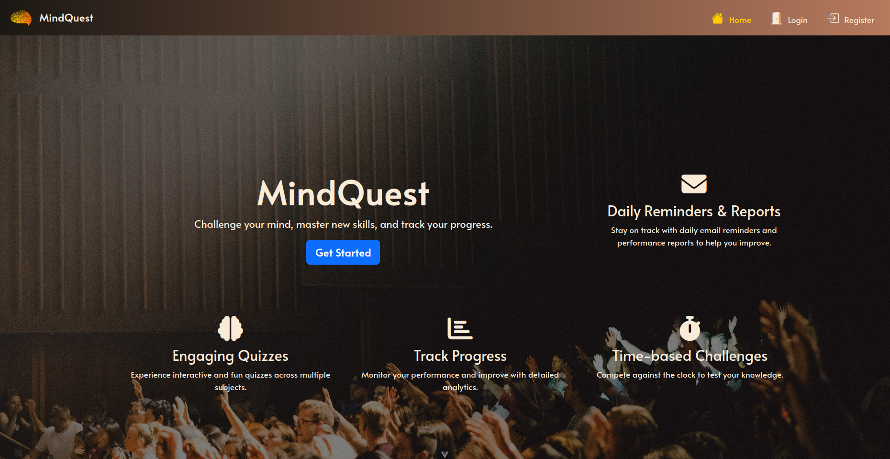
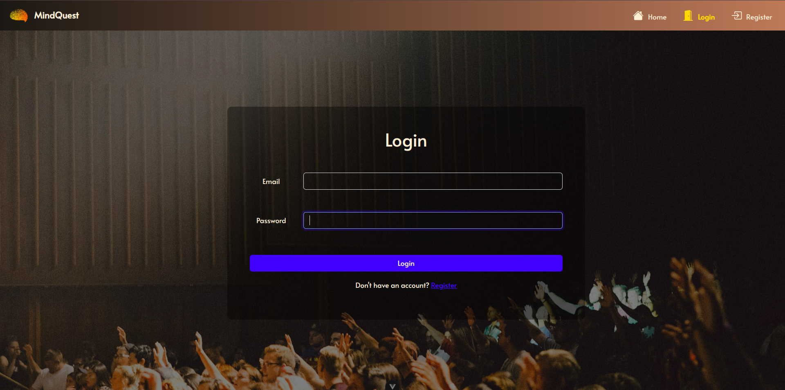
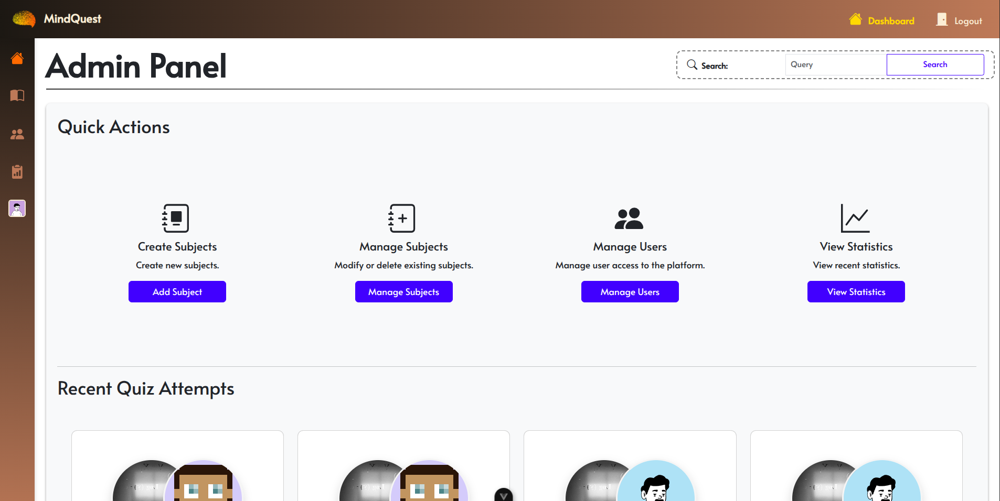
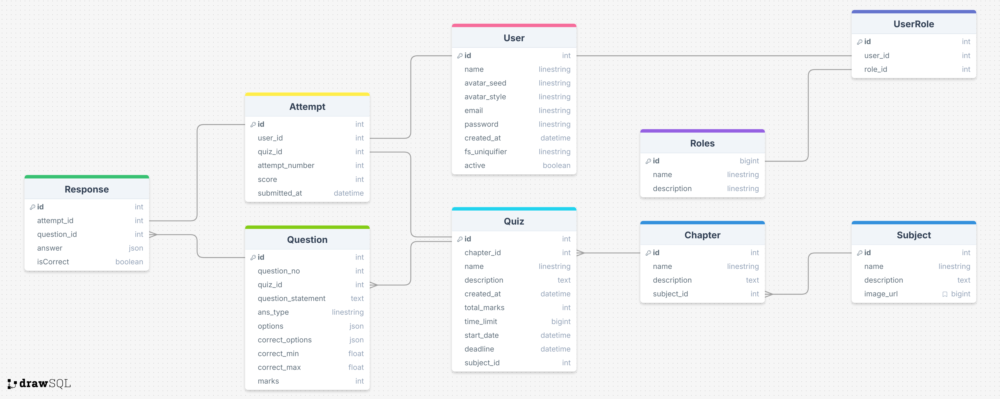

# Note
This repository is to track IIT Madras Modern Application Development II Project for Quiz Master V2.

# MindQuest
A comprehensive quiz management system built with Flask RESTful API and Vue.js 3, designed for educational institutions to create, manage, and track quiz activities with role-based access control.

## 🚀 Features

### User Management & Access Control
- **Role-Based Access Control (RBAC)** with Admin and User roles.
- Dedicated dashboards for both Admin and Users.
- Admin capability to modify user access rights
- Secure authentication and authorization using jwt tokens.

### Content Management
- **Hierarchical Content Structure**: Subjects → Chapters → Quizzes
- Complete CRUD operations for all content types (Admin only)
- Search functionality for both users and admins
- Organized content discovery and navigation

### Quiz System
- Interactive quiz-taking interface for users
- Comprehensive response tracking and history
- User performance analytics and attempt history
- CSV export functionality for quiz attempt data

### Analytics & Monitoring
- **Admin Analytics Dashboard** with graphical statistical overview
- Performance metrics and usage statistics
- Data visualization for insights

### Automation & Notifications
- **Google Workspace Integration** with automated reminders on quiz creation
- Monthly automated email reports
- Asynchronous task processing for seamless user experience

### User Experience
- **Modern, Minimal UI Design** with responsive layout
- Intuitive navigation and user-friendly interface
- Fast and efficient content loading

## Screenshots
|||
|------------------------------------|------------------------------------|
|||
|||
|||
|||
|||
|||

## 🛠️ Tech Stack
### Backend
- **Python 3.12** - Core programming language
- **Flask** - Web framework
- **Flask-RESTful** - RESTful API development
- **Flask-Security-Too** - Role based access control
- **Flask-JWT-Extended** - Token based authentication
- **Flask-SQLAlchemy** - Database ORM
- **Flask-Whooshee** - Databse Indexing
- **Celery** - Asynchronous task queue
- **Redis** - Message broker for Celery


### Frontend
- **Vue.js 3** - Progressive JavaScript framework
- **Vuex** - State management pattern and library
- **Vue Router** - Official router for Vue.js
- **Modern JavaScript (ES6+)** - Enhanced language features

### Infrastructure & Tools
- **Redis** - In-memory data structure store
- **Google Workspace API** - Integration for notifications
- **Email Services** - Automated reporting system
- **CSV Processing** - Data export functionality

## 📋 Prerequisites

Before running this application, ensure you have the following installed:

- Python 3.12
- Node.js 24.3
- Redis Server
- Git

## ⚙️ Installation & Setup
**NOTE** - Since this project uses Redis Server, it can only run on linux systems or WSL on Windows.

### Base configuration
1. **Install NVM**
Follow the installation instructions given on: [Official NVM GitHub Page](https://github.com/nvm-sh/nvm?tab=readme-ov-file#installing-and-updating) to install NVM.

2. **Install Node.JS and NPM**
Once NVM is installed use the following command to install Node.
```bash
$ nvm install 24.3.0
```
After the command finishes running, check if node and npm are installed using the following commands:
```bash
$ node --version
$ npm --version
```

3. **Install Redis Server**
For ubuntu based systems run: `$ sudo apt install redis-server` to install redis
For other distributions follow the instructions given to install Redis OpenSource: [Installation Instructions](https://redis.io/docs/latest/operate/oss_and_stack/install/install-stack/)


### Backend Setup

1. **Clone the repository**
   ```bash
   $ git clone https://github.com/22f1001082/MindQuest.git
   $ cd MindQuest
   ```

2. **Setup virtual environment and install Python dependencies**
    This project can be managed either using UV or pip. 
    It is highly recommended to use uv as it provides improved performance and usability.
    
    *For UV*
    Run the following command to install uv:
    ```bash
    $ curl -LsSf https://astral.sh/uv/install.sh | sh
    ```
    After uv installs, make sure you are in the project folder (MindQuest) and execute the following commands:
    ```bash
    $ cd backend
    $ uv sync
    ```
    UV will automatically create a virutal environment and install the required packages.

    *For pip*
    Make sure pip is installed on your system.
    ```bash
    $ pip --version
    ```
    If pip is installed the output should look like this: 
    ```bash
    pip 24.0 from /usr/lib/python3/dist-packages/pip (python 3.12)
    ```
    
    If you get an error, install pip on your system using either of the following commands based on your distribution type:
        For Ubuntu or Debian based distributions (Linux Mint, PoP!_OS, KDE Neon, Kubuntu, etc.)
    ```bash
    sudo apt install python3-pip
    ```
    For Red Hat based distributions (Fedora, CentOS, OpenSuse, etc)
    ```bash
    $ sudo dnf install python3-pip
    ```
    For Arch based distributions (Arch Linux, Manjaro, EndeavourOS, Garuda, etc.)
    ```bash
    $ sudo pacman -S python-pip
    ```
    
    Once pip is installed, navigate to the backend folder and create a virtual environment using the following command:
    ```bash
    $ cd backend
    $ python3 -m venv .venv
    ```

    Now install the dependencies using the following command:
    ```bash
    $ pip install -r requirements.txt
    ```
3. G-Space Integration
   In order to implement G-Space notifications provide your own api keys and endpoints.
   For G-Space, create a new space and under settings generate a webhook and add it in backend/applications/tasks.py in the generate_msg function replacing the existing value in: `response = requests.post(
        "Webhook Here", json={"text": text})`

3. **Start Redis server**
    ```bash
    $ redis-server
    ```

4. **Start Celery worker and Celery beat**
    ```bash
    $ celery -A app.celery worker --loglevel=info
    $ celery -A app.celery beat --loglevel=info
    ```

5. **Start Flask application**
   ```bash
   $ flask run
   ```

### Frontend Setup

1. **Navigate to frontend directory**
    ```bash
    $ cd frontend
    ```

2. **Install Node.js dependencies**
    ```bash
    $ npm install
    ```
3. **Create .env file with api key for Unsplash**
    This app uses Unsplash API to provide cover images for subject.
    - Create an Unsplash account and follow the instructions on [Unsplash website](https://unsplash.com/documentation#getting-started) to get your api key.
    - Once you have your key, create a .env file in the frontend folder.
    - Open it using any text editor of your choice.
    - Put in your api key as follows: `VITE_UNSPLASH_ACCESS_KEY=<YOUR API KEY>`
    - Save and close the file.

4. **Start frontend server**
    To run a development version run:
    ```bash
    $ npm run dev
    ```

## 🏗️ Project Structure

```
MindQuest/
├── backend/
│   ├── applications/
│   │   ├── auth.py
│   │   ├── celery_init.py
│   │   ├── config.py
│   │   ├── extensions.py
│   │   ├── mail.py
│   │   ├── models.py
│   │   ├── resources.py
│   │   ├── routes.py
│   │   └── tasks.py
│   ├── instance/
│   ├── migrations/
│   ├── static/
│   ├── whooshee_index/
│   ├── requirements.txt
│   ├── pyproject.toml
│   ├── uv.lock
│   ├── celery_config.py
│   └── app.py
├── frontend/
│   ├── src/
│   │   ├── assets/
│   │   ├── components/
│   │   ├── router/
│   │   ├── store/
│   │   ├── utils/
│   │   ├── views/
│   │   ├── App.vue
│   │   └── main.js
│   ├── public/
│   ├── .env
│   ├── index.html
│   ├── package.json
│   └── vite.config.js
└── README.md

```

## 🔐 User Roles & Permissions

### Admin Users
- Full CRUD access to subject, chapters, and quizzes
- User management and access control
- Analytics dashboard access
- User activity monitoring
- System configuration management
- Data download for all quiz attempts

### Regular Users
- Quiz attempt capabilities
- Personal dashboard access
- Response history viewing
- Content search functionality
- Performance tracking
- Data download for quiz attempts

## Database Schema



## 📊 API Endpoints

### Authentication
- `POST /api/auth/login` - User login
- `POST /api/auth/logout` - User logout
- `POST /api/auth/register` - User registration

### User Management
- `GET /api/users` - Get all users
- `POST /api/reset-password` - Rest password
- `POST /api/delete_account` - Delete user account
- `POST /api/user_activation` - Toggle user activation status (Admin access only)


### Content Management
#### Subjects
- `GET /api/subject` - Get all subjects
- `POST /api/subject` - Create new subject
- `GET /api/subject/<id>` - Get subject by id
- `PUT /api/subject/<id>` - Update subject
- `DELETE /api/subject/<id>` - Delete subject

#### Chapters
- `GET /api/subject/<subject_id>/chapters` - Get all chapters for a subject
- `POST /api/subject/<subject_id>/chapters` - Create new chapter for a subject
- `GET /api/chapter/<chapter_id>` - Get a chapter by id
- `PUT /api/chapter/<chapter_id>` - Update a chapter
- `DELETE /api/chapter/<chapter_id>` - DELETE a chapter

#### Quiz
- `GET /api/chapter/<chapter_id>/quiz` - Get all quizzes for a chapter
- `POST /api/chapter/<chapter_id>/quiz` - Create new quiz for a chapter
- `GET /api/quiz/<quiz_id>` - Get a quiz by id
- `PUT /api/quiz/<quiz_id>` - Update a quiz 
- `DELETE /api/quiz/<quiz_id>` - Delete a quiz 

- `GET /api/quiz/<quiz_id>/view` - Get quiz data for viewing

#### Questions
- `GET /api/quiz/<quiz_id>/questions` - Get questions for a quiz
- `POST /api/quiz/<quiz_id>/questions` - Create a question for a quiz
- `PUT /api/question/<question_id>` - Update a question 
- `DELETE /api/question/<question_id>` - Delete a question 

#### Responses
- `POST /api/quiz/<quiz_id>/response` - Submit responses for a quiz
- `GET /api/response/<attempt_id>` - Get the responses for a attempt

#### Attempts
- `GET /api/attempts` - Get all attempts for all quizzes
- `GET /api/attempts/<quiz_id>` - Get all attempts for a specific quiz

### Search
- `GET /users/search` - Search users
- `GET /search` - Search other resources

### Analytics
- `GET /api/admin/stats` - Statistical data
- `GET /api/export_attempt_csv/<subject_id>` - Data export for subject


## 📝 License

This project is licensed under the MIT License - see the [LICENSE](LICENSE) file for details.

## 🎓 Academic Context

This project was developed as a college assignment to demonstrate proficiency in:
- Full-stack web development
- RESTful API design
- Modern JavaScript frameworks
- Database design and management
- User authentication and authorization
- Asynchronous task processing
- UI/UX design principles


**Note**: This is an educational project developed for academic purposes.

